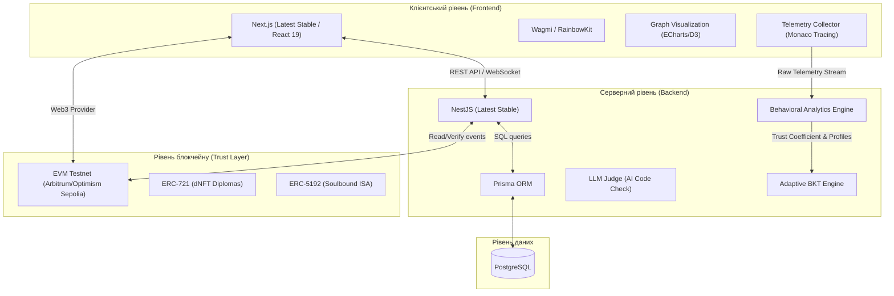

# Технічний стек та архітектура системи «Smart-BKT-Chain»

Цей документ містить детальний опис архітектурного дизайну, структури репозиторію, обраних технологій та інфраструктури для реалізації децентралізованої системи адаптивного навчання та автоматизованого підтвердження компетенцій **«Smart-BKT-Chain»**.

---

## 1. Загальна архітектура системи

Система побудована за принципом триланкової архітектури з додаванням децентралізованого рівня довіри (Blockchain Layer).



---

## 2. Структура монорепозиторію (Monorepo)

Для забезпечення спільної типізації (Shared Types) між фронтендом та бекендом використовується монорепозиторій на базі **npm Workspaces** (або **Turborepo**).

### Орієнтовна структура папок:
```text
smart-bkt-chain/
├── apps/
│   ├── web/                  # Next.js Frontend (Студенти, викладачі, роботодавці)
│   │   ├── src/app/          # App Router
│   │   └── package.json
│   ├── admin/                # Next.js Admin Panel (CMS для контенту та CRM аналітика)
│   │   ├── src/app/          # App Router (Окремий захищений бандл)
│   │   └── package.json
│   ├── api/                  # NestJS Backend (Latest Stable)
│   │   ├── src/              # Модулі (BKT, Auth, Courses, Web3)
│   │   └── package.json
│   └── docs/                 # Next.js Docs & Tech Stack Presenter (Static Export для GitHub Pages)
│       ├── src/
│       └── package.json
├── packages/
│   ├── database/             # Prisma schema та клієнт БД
│   │   ├── prisma/
│   │   │   └── schema.prisma
│   │   └── package.json
│   ├── contracts/            # Solidity смарт-контракти (Hardhat/Foundry)
│   │   ├── contracts/
│   │   └── package.json
│   ├── types/                # Спільні інтерфейси та DTO
│   │   ├── index.ts
│   │   └── package.json
│   └── ui/                   # Спільні компоненти та Storybook (Tailwind + shadcn/ui)
│       ├── src/              # Компоненти інтерфейсу
│       ├── .storybook/       # Конфігурація Storybook
│       └── package.json
├── docs/                     # Проєктна документація
│   └── tech_stack.md
├── docker-compose.yml        # Локальна інфраструктура (PostgreSQL)
├── package.json              # Корневий конфіг workspaces
└── turbo.json                # Конфігурація Turborepo (опціонально)
```

### 2.1. Концепція наскрізної типізації та ізоляції інтерфейсу (End-to-End Type Safety & Component Isolation)

Для запобігання помилкам узгодженості даних на різних рівнях системи та забезпечення однакового дизайну, монорепозиторій реалізує наскрізну типізацію та ізоляцію інтерфейсу за чотирма основними векторами:

1.  **Типізація Бази Даних (`@smart-bkt/database`):**
    *   Prisma Schema лежить у спільному пакеті `packages/database`.
    *   Після запуску `prisma generate`, TypeScript-типи для всіх таблиць автоматично генеруються та експортуються з цього пакета.
    *   Фронтенд (Next.js) та бекенд (NestJS) імпортують моделі сутностей (наприклад, `Student`, `SkillNode`, `Course`) безпосередньо з `@smart-bkt/database`, що виключає потребу ручного дублювання моделей.
2.  **Типізація REST/WebSocket API (`@smart-bkt/types`):**
    *   Усі інтерфейси запитів (Request payloads) та відповідей (Response payloads) описуються в окремому пакеті `packages/types`.
    *   Бекенд використовує ці типи як базу для формування DTO (класів валідації запитів з `class-validator`), а фронтенд імпортує ці типи для типізації методів `fetch`/`axios` або хуків `TanStack Query`. Будь-яка зміна структури відповіді на бекенді миттєво підсвітить помилки типізації на фронтенді на етапі збірки (`npm run build`).
3.  **Типізація Смарт-контрактів (`@smart-bkt/contracts`):**
    *   При компіляції Solidity-контрактів у `packages/contracts`, утиліти (Foundry/Hardhat) генерують JSON ABI та відповідні TypeScript-інтерфейси.
    *   Фронтенд (через Wagmi/Viem) та бекенд (через Viem релейєри) імпортують ці згенеровані ABI та типи. При зміні сигнатури методу смарт-контракту (наприклад, додавання аргументу у функцію `mintDiploma`), TypeScript підсвітить помилки компіляції у коді викликів і на клієнтській, і на серверній частині.
4.  **Спільна дизайн-система та Storybook (`@sbc/ui`):**
    *   Усі UI-компоненти, побудовані на базі Tailwind CSS та Radix UI (shadcn/ui), розробляються в ізольованому пакеті `packages/ui`.
    *   **Storybook** (на базі `@storybook/react-vite`) інтегрований безпосередньо у цей пакет для розробки компонентів у повній ізоляції від логіки сторінок, стану додатків чи API-запитів.
    *   Такий підхід запобігає дублюванню верстки між `apps/web` та `apps/admin`, гарантує повну відповідність єдиному дизайн-коду та дозволяє тестувати складні інтерактивні стани (наприклад, візуалізацію графа знань та Web3-віджети) з використанням моків.

---

## 3. Детальний опис компонентів стека

### 3.1. Frontend (Клієнтська частина)
*   **Фреймворк:** **Next.js 16+ (остання стабільна версія)** (на базі React 19+).
    *   *Чому:* Повна сумісність із серверними компонентами (RSC). Для оптимізації SEO застосовується гібридна модель: **Public Zone** (статична генерація SSG для лендингу та відкритих профілів студентів/портфоліо навичок) та **Private Zone** (динамічний SSR/CSR під захистом `middleware.ts` для кабінетів студентів та викладачів).
*   **Архітектурна методологія:** **Feature-Sliced Design (FSD)**.
    *   *Чому:* Забезпечує чітку та масштабовану декомпозицію клієнтського коду на незалежні шари (`shared`, `entities`, `features`, `widgets`, `pages`, `app`). У поєднанні з Next.js 16+ папка `app/` слугує суто точкою входу для роутингу та лейаутів, а відображення сторінок делегується шару `src/pages`. Це виключає перехресні залежності та спагеті-код, а також дає змогу детально описати архітектурну модель у теоретичній частині дисертації.
*   **Стилізація та UI:** **Tailwind CSS + shadcn/ui (Radix UI)**.
    *   *Чому:* Швидка адаптивна верстка, можливість створення преміального дизайну. Усі Web3-компоненти та інтерактивні елементи ізолюються для уникнення **Hydration Mismatch** помилок через різницю серверного та клієнтського рендерингу (використовуючи перевірки монтування `isMounted` та `dynamic` імпорт з `ssr: false`).
*   **Керування даними та таблицями:** **TanStack Table (React Table)**.
    *   *Чому:* У поєднанні з Tailwind це дозволяє реалізувати будь-які складні таблиці з фільтрацією, пагінацією, пошуком та сортуванням. Оскільки бібліотека є "headless" (не нав'язує своїх стилів, на відміну від Ant Design), ми отримуємо повну свободу у візуалізації даних без втрати функціоналу.
*   **Керування станом (State Management):**
    *   **Zustand** (локальний глобальний стан UI) + **TanStack Query** (серверний стан).
    *   *Чому:* Для синхронізації з базою та Web3 ми використовуємо **TanStack Query** (він уже інтегрований у Wagmi «з коробки», тому не додасть додаткової ваги проєкту). Для чисто клієнтських станів (темна тема, стан сайдбару, активні сесії гаманця) використовуємо **Zustand** — це ультралегка (1KB) альтернатива Redux, що не має зайвого шаблону (boilerplate) і чудово працює з React Server Components. Для фільтрів у таблицях стан зберігаємо безпосередньо в URL (через `searchParams`), що дозволяє користувачам ділитися прямими посиланнями.
*   **Web3-інтеграція:** **RainbowKit** + **Wagmi** + **Viem** (з налаштованим **WalletConnect Cloud Project ID**).
    *   *Чому:* Найбільш надійний та зручний стек для підключення криптогаманців та взаємодії зі смарт-контрактами з боку браузера. Налаштування WalletConnect Cloud Project ID є обов'язковим для коректної підтримки мобільного UX через Deep Linking у Safari/Chrome.
*   **Мультимовність (Internationalization - i18n):** **next-intl**.
    *   *Чому:* Проєкт має подвійне позиціонування: українська мова є обов'язковою для академічного захисту в ПНПУ та інтеграції з локальними програмами МОН, а англійська — де-факто стандарт для глобального Web3 та IT-рекрутингу. Бібліотека `next-intl` забезпечує маршрутизацію (наприклад, `/ua/dashboard`, `/en/dashboard`) та повну підтримку Next.js Server Components.
*   **Візуалізація:** **Apache ECharts** або **D3.js** (з динамічним ледачим завантаженням).
    *   *Чому:* Необхідні для побудови інтерактивного та динамічного Графа знань студента. Для збереження продуктивності (запобігання блокуванню основного потоку важким JS) бібліотека завантажується ліниво, а координати графа обраховуються на бекенді для миттєвого рендерингу SVG-шаблону на фронтенді.
*   **Введення коду (Code Editor Component):** **CodeMirror 6** або **@monaco-editor/react** (з лінивим завантаженням).
    *   *Чому:* Студенти мають писати код у повноцінному середовищі з підсвічуванням синтаксису та автодоповненням. Для оптимізації швидкості завантаження сторінки (LCP) редактор завантажується динамічно з відображенням Skeleton UI під час підготовки.
*   **Збір телеметрії (Telemetry Collector):** Спеціальний перехоплювач подій введення для Monaco/CodeMirror.
    *   *Чому:* Необхідний для реєстрації часових пауз, темпу введення символів та подій вставки тексту (copy-paste) з метою виявлення використання сторонніх інструментів або ШІ-генераторів безпосередньо в процесі написання коду.

### 3.2. Admin Panel (Панель адміністрування - CMS & CRM)
*   **Фреймворк:** **Next.js 16+ (остання стабільна версія)**.
    *   *Чому:* Створюється як окремий ізольований додаток `apps/admin` у монорепозиторії. Це гарантує повне розділення бандлів (студенти не завантажують важкий адміністративний JS-код) та максимальний рівень безпеки (адміністративний код недоступний для клієнтського інспектування).
*   **Стилізація та UI:** **Tailwind CSS + shadcn/ui**.
    *   *Чому:* Уніфікована дизайн-система з основним сайтом. Рендериться у вигляді щільного аналітичного дашборду (Dense Dashboard UI).
*   **Основний функціонал CMS:**
    *   Конструктор дерева навичок (Skill Graph Builder) для візуального редагування вузлів та зв'язків.
    *   Керування курсами, практичними завданнями, тестами та unit-тестами для автоперевірки коду.
*   **Основний функціонал CRM:**
    *   Аналітична панель успішності студентів (прогрес BKT-показників по групах/ВНЗ).
    *   Аудит та верифікація акаунтів (користувачі, підтвердження університетських доменів).
    *   Панель Web3-управління: ручний або автоматичний ініціатор відновлення Soulbound-токенів (SBT Recovery) у випадку компрометації гаманця студента.

### 3.3. Backend (Серверна логіка)
*   **Фреймворк:** **NestJS (остання стабільна версія)**.
    *   *Чому:* Модульна архітектура, підтримка TypeScript, легка інтеграція з різними бібліотеками та простота масштабування.
*   **Архітектурна методологія:** **Гексагональна архітектура (Hexagonal Architecture / Ports & Adapters) + DDD (Domain-Driven Design)**.
    *   *Чому:* Відокремлює чисте математичне ядро (BKT-модуль, логіку валідації графів) та бізнес-правила (домени `Student`, `Assessment`, `Credential`) від технологічних інструментів (бази даних, ORM, Web3 бібліотек). Порти (Ports) визначають інтерфейси, а адаптери (Adapters) реалізують їх під конкретні технології (Prisma, Viem, Gemini API). Це забезпечує 100% покриття бізнес-логіки юніт-тестами через мок-адаптери, незалежність коду ядра та легкість заміни інфраструктурних бібліотек. Додатково для відокремлення операцій запису (BKT обчислення, блокчейн) від читання (дашборди, графіки знань) інтегрується патерн **CQRS** (через `@nestjs/cqrs`).
*   **Авторизація та безпека (AuthN/AuthZ):**
    *   **Гібридний підхід:** **SIWE (Sign-In with Ethereum - ERC-4361)** для студентів (вхід через підпис криптографічного повідомлення гаманцем) + **JWT / OAuth2 (Google SSO)** для викладачів, адміністраторів ВНЗ та представників ІТ-компаній.
    *   **Рольова модель (RBAC):** Адміністратор (керування закладами освіти, користувачами, налаштуваннями BKT та смарт-контрактів), Викладач (керування графом знань, аналітика, розробка курсів), Студент (проходження курсів, мінтинг dNFT/SBT), Роботодавець (доступ до маркетплейсу верифікованих резюме).
    *   **Безпека ключів (Hot Wallet Security):** Для транзакцій мінтингу приватний ключ гарячого гаманця платформи ізолюється та зберігається в хмарних сховищах секретів (**Google Secret Manager** або **AWS KMS**), а не в текстовому вигляді у файлі `.env`, з обмеженням прав доступу на рівні смарт-контракту.
*   **Асинхронність та Обробка запитів:**
    *   **WebSockets (Socket.io в NestJS) / SSE:** Для уникнення тайм-аутів (Gateway Timeouts) при тривалій роботі LLM Judge, запити обробляються асинхронно. Користувач отримує статус `202 Accepted` одразу, а результат перевірки надсилається через вебсокети.
    *   **Черги та Транзакційні замки:** Для вирішення проблеми гонки запитів (Race Conditions) при паралельних відповідях студента, обчислення BKT захищаються песимістичним блокуванням на рівні бази даних (`SELECT ... FOR UPDATE` у Prisma транзакціях) або чергою завдань (**BullMQ / Redis**).
*   **Штучний інтелект та математика:**
    *   **Адаптивний BKT-модуль:** Окрема сервісна служба на NestJS, що оперує ймовірнісними матрицями для розрахунку $P(L_t)$. На відміну від класичного BKT, параметри Slip $P(S)$ та Guess $P(G)$ оновлюються динамічно на основі поведінкових метрик студента. Для вирішення проблеми **«Холодного старту» (Cold Start)** інтегрується стартове діагностичне тестування для оцінки базового $P(L_0)$.
    *   **Модуль поведінкової аналітики (Behavioral Analytics):** Сервіс на бекенді, що агрегує потоки сирої телеметрії введення коду. Обчислює аномалії темпу, тривалості пауз між блоками та виявляє факти масової вставки готового коду, вираховуючи коефіцієнт довіри (Trust Coefficient) до результату.
    *   **LLM Judge (Гібридний підхід):** Для оптимізації latency та витрат на API перевірка коду будується каскадно: спочатку виконуються unit-тести та статичний аналіз AST, і лише у разі потреби семантичного аналізу чи детального фідбеку підключається LLM (Gemini API), результат якого коригується рівнем довіри від модуля аналітики.
*   **База даних:** **PostgreSQL (з пулером з'єднань PgBouncer)**.
    *   *Чому:* Надійна реляційна СУБД для зберігання профілів, зв'язків графа знань та логування відповідей. Для запобігання вичерпанню лімітів з'єднань (Connection Exhaustion) при масштабуванні контейнерів NestJS підключається PgBouncer. Для боротьби з розростанням історичних даних логів (Database Bloat) закладається періодична агрегація та партиціонування таблиць.
*   **ORM:** **Prisma ORM**.
    *   *Чому:* Автоматична генерація TypeScript-типів на основі схеми бази даних, що виключає неузгодженість даних між бекендом та БД.
*   **Джерела даних (Oracles):** **GitHub App (Webhooks)** для MVP.
    *   *Чому:* Замість складних та дорогих оракулів Chainlink на етапі MVP інтеграція з GitHub реалізується через Web2-аплікацію та вебхуки на бекенді, що відслідковують та валідують комміти студентів без плати за газ. Використання оракулів Chainlink закладається як архітектурне розширення для майбутнього масштабування.
*   **Документування API:** **Swagger (OpenAPI v3)** через модуль `@nestjs/swagger`.
    *   *Чому:* Забезпечує автоматичну генерацію інтерактивної специфікації API прямо з коду (контролерів та DTO) за допомогою TS-декораторів. Інтерфейс Swagger UI розгортається на ендпоінті `/api/docs`, надаючи фронтенд-розробникам можливість бачити актуальні схеми запитів/відповідей та тестувати їх у реальному часі.

### 3.4. Blockchain (Рівень довіри)
*   **Мова смарт-контрактів:** **Solidity** (компілятор 0.8.20+).
*   **Середовище розробки:** **Hardhat** / **Foundry**.
    *   *Чому:* Для написання, тестування (100% покриття логіки) та деплою контрактів.
*   **Стандарти токенів:**
    *   **ERC-721 (dNFT) з підтримкою мета-транзакцій (ERC-2771):** Динамічні сертифікати. Метадані оновлюються за гібридним принципом: динамічні зміни статусу (Proof of Maintenance) регулюються API бекенду із періодичним анкорингом стану в децентралізовані сховища. Для усунення бар'єру транзакційних витрат (gas fees) для студентів, використовується схема спонсорованих транзакцій (gasless) через релейєр (Relayer).
    *   **ERC-5192 (Soulbound NFT) з механізмом відновлення:** Для фіксації непередаваних зобов'язань ISA. Контракт містить функцію відновлення (Recovery), яка дозволяє платформі перевипустити токен на новий гаманець студента у випадку втрати приватного ключа або компрометації його адреси.

---

## 4. Інфраструктура та DevOps

### 4.1. Контейнеризація (Docker)
Для локальної розробки створюється файл `docker-compose.yml`, який розгортає:
*   Службу **PostgreSQL** (база даних).
*   Службу **pgAdmin** (для зручного керування базою даних через браузер).

Для бекенду та фронтенду створюються індивідуальні `Dockerfile` (багатоетапне збирання — Multi-stage builds) для отимізації розміру фінальних образів.

### 4.2. CI/CD (GitHub Actions)
Автоматизація процесів налаштовується через робочі процеси (Workflows):
1.  **Linter & Formatter:** Перевірка відповідності коду стандартам (ESLint, Prettier).
2.  **Type Check:** Компіляція TypeScript для перевірки відсутності помилок типізації в монорепозиторії.
3.  **Tests:** Автоматичний запуск юніт-тестів BKT, інтеграційних тестів API та смарт-контрактів перед кожним Pull Request.
4.  **Deployment:**
    *   Фронтенд (`apps/web`) авто-деплоїться на **Vercel**.
    *   Бекенд (`apps/api`) збирається в Docker-образ та деплоїться на **Railway / Render / Google Cloud Run**.
    *   Сайт презентації та документації (`apps/docs`) авто-деплоїться як статичні HTML/CSS/JS (Static Export) на **GitHub Pages** при кожному пуші у гілку `main`.

---

## 5. Стратегія тестування (Testing Strategy)

Тестування складної Web3-екосистеми з ШІ-модулями будується на чотирьох рівнях:

### 5.1. Юніт-тестування (Unit Testing)
*   **BKT-ядро:** 100% покриття Jest-тестами математичних обчислень ймовірностей $P(L_t)$. Перевірка переходів станів на основі фіксованих матриць переходів (параметрів $P(G), P(S), P(T)$).
*   **Доменна логіка:** Тестування чистих сервісів і доменів (Hexagonal Core) без залучення бази даних та NestJS-модулів.

### 5.2. Інтеграційне та E2E тестування (Integration & E2E)
*   **NestJS API & DB:** Тестування REST-ендпоінтів за допомогою `@nestjs/testing` та `Supertest`. Для тестів використовується піднята в Docker тимчасова тестова база даних PostgreSQL. Перевіряються ролі RBAC (Student/Educator/Employer) та валідація DTO.
*   **Мокання ШІ (Mocking LLM):** Під час автоматичного тестування виклики до API OpenAI/Gemini повністю перехоплюються через мок-адаптери. Це робить тести детермінованими, швидкими і безкоштовними.

### 5.3. Тестування смарт-контрактів (Contract Testing & Fuzzing)
*   **Юніт-тести контракту:** Написання тестів у середовищі **Foundry** (мова Solidity) або **Hardhat** (JS/TS + Chai) для перевірки:
    *   Оновлення метаданих dNFT (ERC-721).
    *   Блокування передачі токенів (ERC-5192).
    *   Логіки відновлення доступу (SBT Recovery).
*   **Фазінг (Fuzz Testing):** Використання **Foundry Fuzzing** для запуску контрактів із тисячами випадково згенерованих параметрів (наприклад, випадкових адрес відновлення або некоректних сигнатур), щоб перевірити стійкість до зламів та логічних помилок.

---

## 6. Стратегія документування (Docs as Code)

Вся документація проєкту зберігається безпосередньо в репозиторії у форматі Markdown/MDX (`docs/`) та динамічно візуалізується на сайті документації `apps/docs`:

### 6.1. Структура живих документів (Living Docs)
*   **Сайдбар та навігація:** Генеруються автоматично на основі структури вкладених папок та файлів у `docs/`.
*   **Математичний рендеринг:** Підтримка KaTeX для рендерингу LaTeX-формул розрахунку ймовірностей BKT ($P(L_t)$).
*   **Авто-діаграми БД (ERD):** Автоматична ERD-діаграма бази даних, згенерована за допомогою `prisma-erd-generator` безпосередньо з `schema.prisma`.
*   **Інтерактивна схема монорепозиторію:** Динамічний граф залежностей пакетів монорепозиторію (через `dependency-cruiser` та ECharts), який сканує реальні `import`-зв'язки TypeScript-файлів під час збірки.
*   **Інтерактивна специфікація API:** Вбудований інтерфейс Swagger UI, що зчитує автогенерований файл `swagger.json` з бекенду NestJS.

---

## 7. План локального запуску розробника

1.  **Клонування репозиторію:**
    ```bash
    git clone <repository_url>
    cd smart-bkt-chain
    ```
2.  **Запуск локальних сервісів (БД):**
    ```bash
    docker-compose up -d
    ```
3.  **Встановлення залежностей та налаштування Prisma:**
    ```bash
    npm install
    npx prisma migrate dev
    ```
4.  **Запуск у режимі розробки:**
    ```bash
    npm run dev
    ```
    *(Ця команда запустить паралельно Next.js на порту `3000` та NestJS на порту `4000`)*